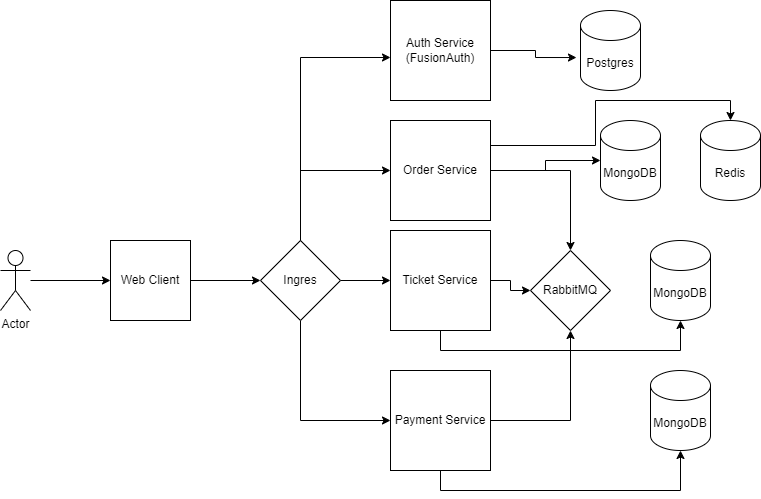

# A Ticket reservation app built using microservices and runs on Kubernetes



## Tech Stack

    - Typescript
    - NestJS
    - MikroORM
    - MongoDB
    - Redis
    - RabbitMQ
    - NextJS
    - Mantine UI
    - FusionAuth
    - NX Monorepo

## Development machine setup:

    - Rancher Desktop
    - Node 20
    - Pnpm
    - kubectl
    - helm
    - Lens
    - Vscode

App is exposed at ticketing.dev via ingres. Edit your hosts file to add the domain.

```text
127.0.0.1 ticketing.dev
127.0.0.1 auth.ticketing.dev
```

## Installation of dependencies using helm

NGINX Ingress Controller
Visit https://docs.rancherdesktop.io/how-to-guides/setup-NGINX-Ingress-Controller

Postgres
https://github.com/bitnami/charts/blob/main/bitnami/postgresql/README.md

```sh
helm repo add bitnami https://charts.bitnami.com/bitnami
kubectl create namespace dev
helm install my-pg bitnami/postgresql -f bitnami-postgres.values.yaml --set auth.postgresPassword=postgres_pass --namespace dev

```

FusionAuth
https://fusionauth.io/docs/get-started/download-and-install/kubernetes/fusionauth-deployment

```sh
helm repo add fusionauth https://fusionauth.github.io/charts
helm install my-fusionauth fusionauth/fusionauth -f ./fusionauth.values.yaml

```

MongoDB
https://github.com/bitnami/charts/tree/main/bitnami/mongodb

```sh
kubectl create namespace mongodb
helm install my-mongo bitnami/mongodb -n mongodb -f ./bitnami-mongo.values.yaml

```

RabbitMQ

```sh
kubectl create namespace rabbitmq
helm install my-rabbitmq bitnami/rabbitmq -n rabbitmq -f ./bitnami-rabbitmq.values.yaml

```

✨ **This workspace has been generated by [Nx, a Smart, fast and extensible build system.](https://nx.dev)** ✨

## Port forwarding

Use Lens app to easily port forward services deployed in kubernetes

## Start the app

To start the web-client development server run `nx serve web-client`. Open your browser and navigate to http://localhost:3000/. Happy coding!

## Generate code

If you happen to use Nx plugins, you can leverage code generators that might come with it.

Run `nx list` to get a list of available plugins and whether they have generators. Then run `nx list <plugin-name>` to see what generators are available.

Learn more about [Nx generators on the docs](https://nx.dev/plugin-features/use-code-generators).

## Running tasks

To execute tasks with Nx use the following syntax:

```
nx <target> <project> <...options>
```

You can also run multiple targets:

```
nx run-many -t <target1> <target2>
```

..or add `-p` to filter specific projects

```
nx run-many -t <target1> <target2> -p <proj1> <proj2>
```

Targets can be defined in the `package.json` or `projects.json`. Learn more [in the docs](https://nx.dev/core-features/run-tasks).

## Want better Editor Integration?

Have a look at the [Nx Console extensions](https://nx.dev/nx-console). It provides autocomplete support, a UI for exploring and running tasks & generators, and more! Available for VSCode, IntelliJ and comes with a LSP for Vim users.

## Ready to deploy?

Just run `nx build demoapp` to build the application. The build artifacts will be stored in the `dist/` directory, ready to be deployed.

## Set up CI!

Nx comes with local caching already built-in (check your `nx.json`). On CI you might want to go a step further.

- [Set up remote caching](https://nx.dev/core-features/share-your-cache)
- [Set up task distribution across multiple machines](https://nx.dev/nx-cloud/features/distribute-task-execution)
- [Learn more how to setup CI](https://nx.dev/recipes/ci)
